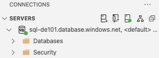
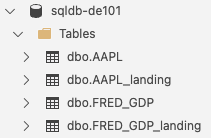
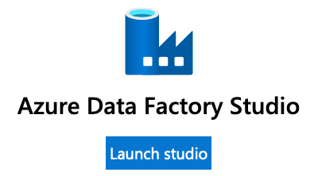
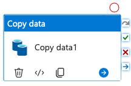
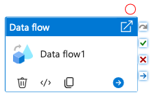

# Extract and Load: Azure Data Factory

In previous practice we provisioned our environment with all resources required for ELT, in this practice we will be doing the EL part from the ELT.

>Azure calls this part (Load) *"Copy"* \
>We will be using different sources to copy to a database or datawarehouse

## What you will learn

* ADF
* Load from different sources to database or data warehouse

## Practice

You are a data engineer working for a credit rating agency. You need to:

* Get Stock Market Data every day
* Store it in a Data Warehouse for financial research and analysis for further publication.

>You work in the team responsible of getting Nasdaq data from different resources or formats.

### Requirements

Use the previous infrastructure to:

* Load data from a datalake into database
* Load data from a HTTP source into a DB
* Load data from a DB into a DW
* Transform data types with Data Flow activities in ADF

>* Use the create_tables.sql script to create the required structures on your database \
>  *Use the `_landing` tables when doing direct pass loads and the other tables when doing transformations*
>* Follow the naming convention used in the last session

### Step 0 - Launch

#### Step 0.1 - SSMS/Azure Data Studio

>Additional to open our tool, we need to create the required structure to load the data for another steps

* Open SSMS/ADS
* On the top left you will see the connections icon

  
  * Click the connection we create on the previous session \
    *If you swapped network/ip from the last time you openened ADS you may need to refresh credentials*

    

    Once you are done, the connection will change to a green icon and you will be able to see some folders on it

    
* Right click `Databases` > `sqldb-de101` > `New Query`
* Paste the contents of `create_tables.sql`
* Click run, the output should be something similar to this

  ```log
  5:38:41 PMStarted executing query at Line 1
          Commands completed successfully.
          Total execution time: 00:00:00.052
  ```

  * You can query the tables to verify they exists or explore the folders to verify it \
    

* Run `create_tables_dw.sql` on `sqldw-de101`

#### Step 0.2 - Azure Data Factory Studio

* Go to [Azure Portal][azure_portal]
* Then login
* Go to `Data factories` and click on your azure data factory (`adf-de101`)
  
* On the main panel click on `Launch Studio`
  

### Step 1 - Load

#### 1.1 - datalake2db

>In this step we will use the csv file we upload on the last session to parse it into a database table (sql-de101.sqldb-de101.AAPL_Landing)

* Click `Author`

  
* Click `Pipelines` > `...` > `New Pipeline`
* On `Activities`
  * Click `Move and transform`
  * Drag `Copy data` to the center panel
    

* On `Properties` panel
  * Change the name to `pl-datalake2db`
* Select your `Copy data` element and a bottom panel will appear
  * Rename to `pl-datalake2db-copy`
  * Go to `Source`
    * Create a new `Source dataset`
      * Search `Azure Blob Storage`

        
      * Select `Delimited Text`

        

        * Name: `ds_csv_AAPLLanding`
        * Linked Service: `ls_blobl_de101`
        * File paht: Browse to `aapl.csv`
        * First row as header: `Checked` \
          *This indicate if the first row is a header and should be skipped*
      * Use all other defaults
  * Go to `Sink`
    * Create a new `Sink Dataset`
      * Search `Azure SQL Database`

        

        * Name: `ds_asqlt_AAPLLanding`
        * Linked Service: `ls_sqldb_de101`
        * Table name: `dbo.AAPL_landing`
      * Use all other defaults
  * Since we are building an ELT we will not make transformations during this step, however if you want to know how it's done:
    * Go to `Mapping` > `Import schemas` \
      *This will generate an auto mapping from the Source to the Sink (Output), then we can fix any inconsistence*
    * Click `Clear` to undo the Mapping changes
* On the top of the screen click `Validate all`
* On the top of the screen click `Publish all`
* On the top of the center panel click `Debug` \
  *This will queue your activity and after some seconds will Succeeded it*

  

Use your SSMS/ADS to verify the results


#### 1.2 - http2db

>In this step we will use the http resource (web csv) registered on the last session to parse it into a database table (sql-de101.sqldb-de101.FRED_GDP_landing)

* Create a new pipeline
  * Name: `pl-http2db`
  * `Copy data` activity
    * Name: `pl-http2db-copy`
    * `Source`
      * `HTTP`
        * Type: `DelimitedText`
        * Name: `ds_http_FREDGDP`
        * Linked service: `ls_http_nasdaq`
        * Relative URL: `api/v3/datasets/FRED/GDP.csv?collapse=annual&order=asc&column_index=1`
        * First row as header: `Checked`
      * Use all other defaults
    * `Sink`
      * `Azure SQL Database`
        * Name: `ds_asqlt_FREDGDPLanding`
        * Linked Service: `ls_sqldb_de101`
        * Table name: `FRED_GDP_landing`
      * Use all other defaults
* On the top of the screen click `Validate all`
* On the top of the screen click `Publish all`
* On the top of the center panel click `Debug` \

Use your SSMS/ADS to verify the results


#### 1.3 - db2dw

>In this step we will use the AAPL_landing table from step 1 (sql-de101.sqldb-de101.AAPL_landing) then parse it into a datawarehouse table (sql-de101.sqldw-de101.AAPL_landing)

* Create a new pipeline
  * Name: `pl-db2dw`
  * `Copy data` activity
    * Name: `pl-db2dw-copy`
    * Source: `ds_asqlt_AAPLLanding` \
      *This is the sink datasource we created for the [datalake2db](#11---datalake2db) step*
      * Use all other defaults
    * `Sink`
      * `Azure Synapse Analytics`
        * Name: `ds_synapse_dw`
        * Linked Service: `ls_synapse_de101`
        * Table name: `dbo.AAPL_landing`
      * Use all other defaults
    * `Settings`
      * Enable staging: `Checked`
      * Staging account linked service: `ls_datalake_de101`
      * Storage Path: Browse to `c-de101datalake-data/staging`
      * Use all other defaults
* On the top of the screen click `Validate all`
* On the top of the screen click `Publish all`
* On the top of the center panel click `Debug`

Use your SSMS/ADS to verify the results


### Step 2 - Transform

On the EL part of the ELT we sometimes can do small transformations that can help during the transform step, in this case we will change the datatypes using Data flow

* We will be using the output of the [Step 1 - Load](#step-1---load) (`Copy data`) as input for this step

>Keep in mind that there is not just one way to build a pipeline. It will depend on your business needs and resources available.

#### 2.1 - aapl

* Click Pipeline `datalake2db`
* On `Activities`
  * Click `Move and transform`
  * Drag `Data flow` to the center panel
    

    * Name `pl-datalake2db-flow`
    * Link pl-datalake2db-copy to `pl-datalake2db-flow` \
      *Drag and drop the `success`  from the copy to the flow*

      

    * Settings
      * Create a new `Data flow`
        * Name: `df_asqlt_AAPLLanding` \
          *On the top of right panel*
        * On the top of the center panel click `Add source`
          * `Source Settings`
            * Name: `AAPLlanding`
            * Dataset: `ds_asqlt_AAPLLanding`
        * On the top of the center panel click `+` > `Cast` \
          *Next to the Source you just added*
          * `Cast Settings`
            * Name: `AAPLlanding2AAPL`
            * Columns

              |Column name|Type|Format|
              |-|-|-|
              |Date|date|dd-MM-yyyy|
              |Low|float|`none`|
              |Open|float|`none`|
              |Volume|float|`none`|
              |High|float|`none`|
              |Close|float|`none`|
              |Adjusted Close|float|`none`|
        * On the top of the center panel click `+` > `Sink` \
          *Next to the Cast you just added*
          * `Sink Settings`
            * Name: `AAPL`
            * Incoming `AAPLlanding2AAPL`
            * Sink type: `Dataset`
            * `Dataset`
              * Create a new `Sink Dataset`
                * Search `Azure SQL Database`
                  * Name: `ds_asqlt_AAPL`
                  * Linked Service: `ls_sqldb_de101`
                  * Table name: `dbo.AAPL`
                * Use all other defaults
      * Your data flow should look like this
        
* On the top of the screen click `Validate all`
* On the top of the screen click `Publish all`
* Go back to the pipeline `datalake2db`
* On the top of the center panel click the arrow down next to `Debug` > `Use activity runtime`
* Use your SSMS/ADS to verify the results

#### 2.2 - fred_gdp

* Click Pipeline `http2db`
* On `Activities`
  * Click `Move and transform`
  * Drag `Data flow` to the center panel
    * Name `pl-http2db-flow`
    * Link pl-http2db-copy to `pl-http2db-flow` \
      *Drag and drop the `success`  from the copy to the flow*
    * Settings
      * Create a new `Data flow`
        * Name: `df_asqlt_FREDGDPLanding` \
          *On the top of right panel*
        * On the top of the center panel click `Add source`
          * `Source Settings`
            * Name: `FREDGDPLanding`
            * Dataset: `ds_asqlt_FREDGDPLanding`
        * On the top of the center panel click `+` > `Cast` \
          *Next to the Source you just added*
          * `Cast Settings`
            * Name: `FREDGDPLanding2FREDGDP`
            * Columns

              |Column name|Type|Format|
              |-|-|-|
              |Date|date|dd-MM-yyyy|
              |Value|float|`none`|
        * On the top of the center panel click `+` > `Sink` \
          *Next to the Cast you just added*
          * `Sink Settings`
            * Name: `FREDGDP`
            * Incoming `FREDGDPlanding2FREDGDP`
            * Sink type: `Dataset`
            * `Dataset`
              * Create a new `Sink Dataset`
                * Search `Azure SQL Database`
                  * Name: `ds_asqlt_FREDGDP`
                  * Linked Service: `ls_sqldb_de101`
                  * Table name: `dbo.FRED_GDP`
                * Use all other defaults
* On the top of the screen click `Validate all`
* On the top of the screen click `Publish all`
* Go back to the pipeline `http2db`
* On the top of the center panel click the arrow down next to `Debug` > `Use activity runtime`
* Use your SSMS/ADS to verify the results

### Step 3 - Drop (Optional)

You can drop `sqldw-de101` resource to keep the cost at the minimum

## Still curious

* In this lesson we use ADF, but how it compares to AWS and GCP?

  Azure Data Factory: \
  Azure Data Factory is a cloud-based data integration service that allows you to create, schedule, and manage data-driven workflows.

  * ETL Capabilities: Supports Extract, Transform, Load (ETL) processes for data movement and transformation.
  * Data Orchestration: Provides data orchestration capabilities to schedule and automate data pipelines.
  * Data Integration: Integrates with Azure services such as Azure Blob Storage, Azure SQL Data Warehouse, and more.
  * Data Flow: Offers Data Flow for visual data transformation and transformation logic.
  * Hybrid Cloud: Strong support for hybrid cloud scenarios with Azure Stack.
  * Integration: Integrates well with Microsoft ecosystem and services.

  AWS Glue: \
  AWS Glue is a managed ETL (Extract, Transform, Load) service that automates data preparation and transformation tasks.

  * ETL Capabilities: Focuses on ETL processes and provides a serverless environment for data transformation.
  * Crawling and Cataloging: Can automatically discover and catalog metadata from various data sources.
  * Data Lake Integration: Well-suited for integration with AWS data lakes and services like Amazon S3, Amazon Redshift, and more.
  * Data Catalog: Includes AWS Glue Data Catalog for storing metadata information.
  * Serverless: Provides serverless execution of ETL jobs.

  Google Cloud Dataflow: \
  Google Cloud Dataflow is a fully managed stream and batch data processing service.

  * Batch and Stream Processing: Supports both batch and stream data processing for real-time and batch workloads.
  * Apache Beam: Dataflow is built on Apache Beam, an open-source unified stream and batch processing model.
  * Data Transformation: Enables data transformation and processing at scale.
  * Serverless: Offers serverless and auto-scaling capabilities.
  * Integration: Integrates with Google Cloud services like BigQuery, Cloud Storage, and Pub/Sub.
  * Dataflow SQL: Allows querying and processing data using SQL-like queries.

* Still want more information:

  * Article: [Compare AWS Glue vs. Azure Data Factory][glue_vs_adf]
  * Article: [Comparing Major Cloud Service Providers][comparing]
  * [Official Azure guide for ETL][azure_etl]

## Links

### Used during this session

* [Pre-Setup][pre-setup]

### Session reinforment and homework help

* [Compare AWS Glue vs. Azure Data Factory][glue_vs_adf]
* [Comparing Major Cloud Service Providers][comparing]
* [Official Azure guide for ETL][azure_etl]

[pre-setup]: ./pre-setup.md

[azure_portal]: https://portal.azure.com/
[glue_vs_adf]: https://www.techtarget.com/searchcloudcomputing/tip/Compare-AWS-Glue-vs-Azure-Data-Factory
[comparing]: https://datatechinsights.hashnode.dev/comparing-major-cloud-service-providers-aws-vs-azure-vs-google-cloud
[azure_etl]: https://learn.microsoft.com/en-us/azure/architecture/data-guide/relational-data/etl
