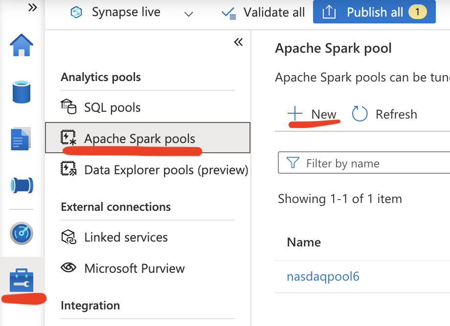
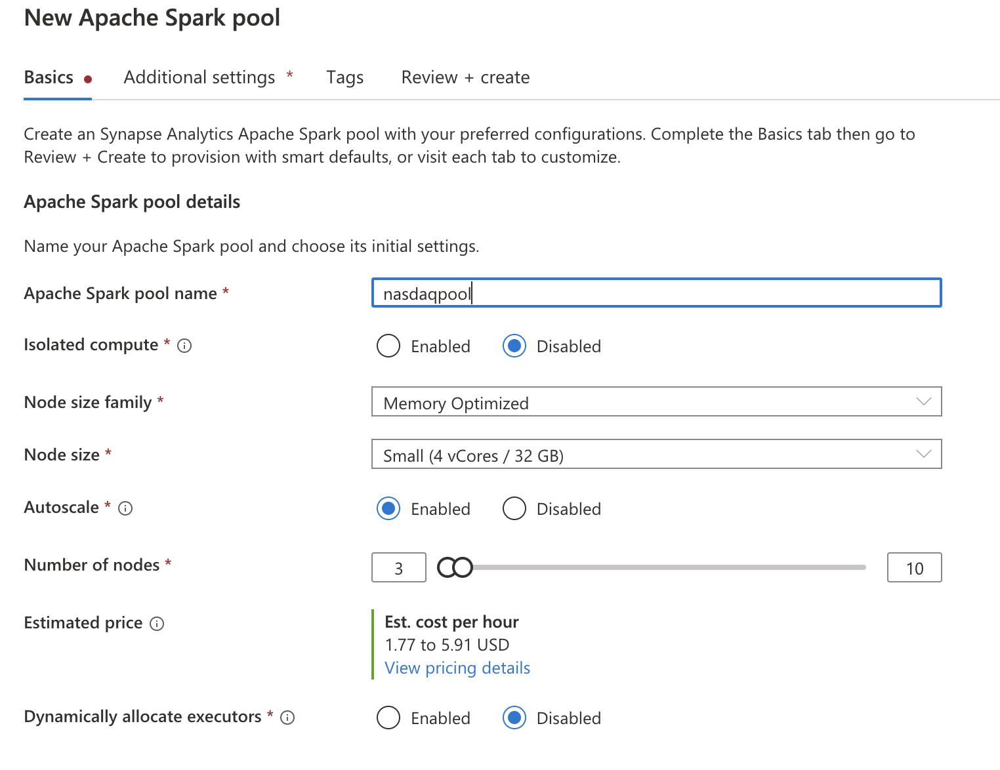

# Pre-Setup

We will be using the Azure account created in the [lesson 16][prev_lesson]

## Requirements

### Azure Synapse (Workspace)

* On the Azure portal, type in and select **Azure Synapse Analytics**
* Select **+ Create**
* Select **Resource group** and **Region** the same as all the above (Leave **Managed resource group** blank)
* Set any name. Suggested similar to "data101-synapse-abc"
* Account name: select the datalake resource created above
* File system name: select "data101_synapse"
* Under security tab, set a new SQL admin user and password (this is a different logical server than the sql databases you create outside synapse workspace). Keep at hand this info, you will use it further down.
* Leave the defaults and **Create**
* Go to **All Resources**, select this synapse resource and click on **Launch Studio**
* It will open a new page similar to ADF workspace
* Note: Synapse Studio does not load on Safari

### Spark Pool

The provisioning took around 60 minutes, at least ONE HOUR BEFORE:

* On your Synapse workspace, go to **Manage** on the left panel, then select **Apache Spark pools** and create a new pool

  
* Set any name (suggested: "weatherapi"). Configure the pool as follows:

  
* Leave the rest with defaults and **Create**
* Wait for 40 minutes until properly provisioned
* Meanwhile you can start editing your python notebook and SQL script. Do not execute anything yet!
* After 40 minutes, under **Manage -> Apache Spark pools** click on **Packages**

  
* Then **Upload** the "requirements.txt" file from this repo

  
* Wait 20 minutes before starting a spark session

>Azure Synapse pools have a higher cost, and since you are working on a free account with 200USD, it is recommended that you create the following resources execute the transformations of this practice, and then delete the SQL pool and Spark pool, so you keep the cost at the minimum. Your published scripts or pipelines and the synapse workspace alone will not generate any cost.

### Open Weather

* Make sure to have in hand your OpenWeather [API key][ow_apikey]

## Links

* [Lesson 16][prev_lesson]
* [OpenWeather API key][ow_apikey]

[prev_lesson]: ../session_16_ELT/README.md
[ow_apikey]: https://home.openweathermap.org/api_keys
